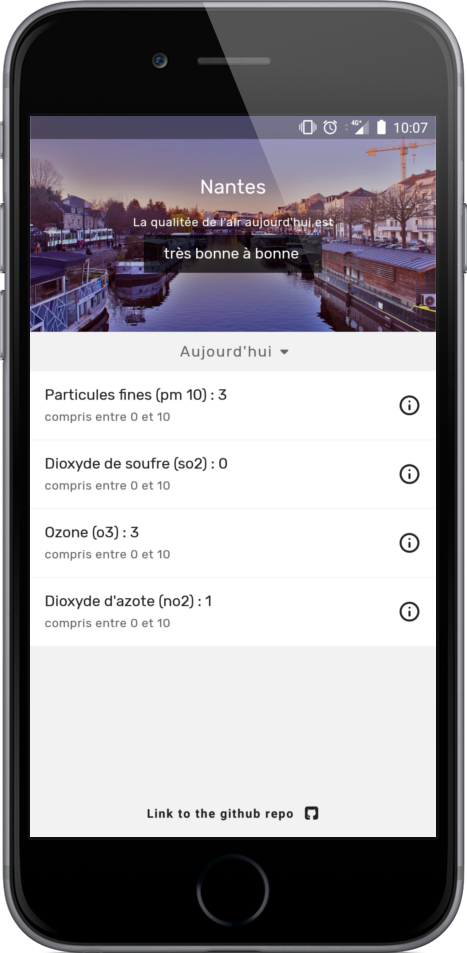

<p align="center">
    
</p>

# airLA
This app helps you track the air quality of Nantes for today and tommorow

I've used [this API](https://data.loire-atlantique.fr/explore/dataset/323266205_indice-atmo-previsionnel-agglomeration-nantaise/api/) from [data.loire-atlantique.fr](https://data.loire-atlantique.fr/pages/home/) to get the appropriate data

<p align="center">
    
</p>

## Functionalities
- track the air quality of Nantes
  - today
  - tommorow
- Find the detailed repport of the different pollution index
  - today
  - tommorow
- Find a description of each pollutant measured

### Upgrade possible
I should probably find antoher API to extend this app to other cities than Nantes

## Technical
To create this app I used the project [create-react-native-app](https://github.com/react-community/create-react-native-app) from [the react-community](https://github.com/react-community/)

### Run in dev mode
to launch the app 'localy' you can follow these steps : 

Make sure you have Node v6 or later installed. No Xcode or Android Studio installation is required.

```sh
$ npm install
$ npm start
```

Install the [Expo](https://expo.io) app on your iOS or Android phone, and use the QR code in the terminal to open your app. Find the QR scanner on the Projects tab of the app.

### Install the current release on android
If you want the current release you can find an unsigned APK inside the [generated](./generated) folder.  
Simply install it on your android phone like any other app (you may need to allow unknown source in order to install it)


